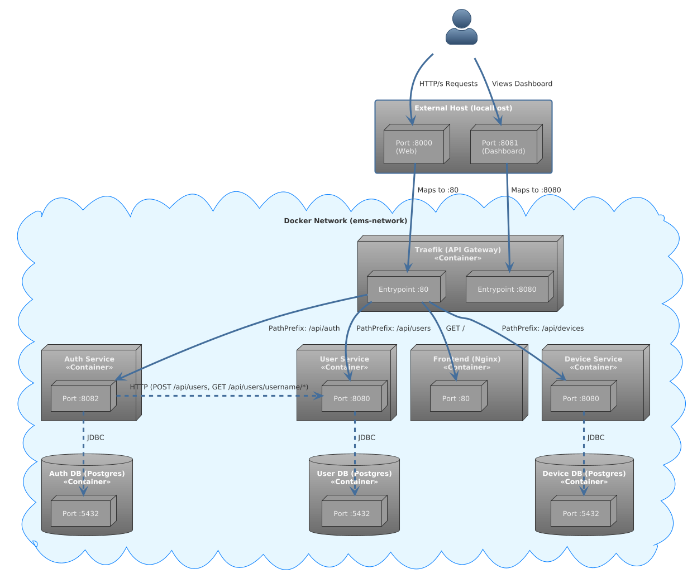

# Energy Management System

This is a full-stack, multi-container application demonstrating a microservices architecture for an Energy Management System. The backend is built with Spring Boot, secured with JWT, and persisted with PostgreSQL. The system is orchestrated with Docker Compose, and all traffic is managed through a Traefik reverse proxy.

## Deployment diagram


## Architecture & Services

This `docker-compose.yml` file will create and manage 8 containers that form the complete application stack:

  * **`frontend`**: An Nginx container that serves the static `index.html` Single-Page Application (SPA) dashboard.
  * **`traefik`**: The reverse proxy (API Gateway) that acts as the single entry point for all traffic. It routes requests to the correct service and provides a monitoring dashboard.
  * **`auth-service`**: The Spring Boot microservice responsible for user registration, login, logout, and JWT management.
  * **`user-service`**: The Spring Boot microservice responsible for all CRUD operations on users, including role management.
  * **`device-service`**: The Spring Boot microservice responsible for all CRUD operations on devices and managing user-device associations.
  * **`auth-db`**: A PostgreSQL database for the `auth-service` (stores refresh tokens).
  * **`user-db`**: A PostgreSQL database for the `user-service`.
  * **`device-db`**: A PostgreSQL database for the `device-service`.

## How to Run (Recommended Method)

The entire application stack is designed to be run with a single Docker Compose command.

### Prerequisites

  * Docker
  * WSL (strongly recommended)

### 1\. Create and Start All Containers

Open a terminal in the root folder of the project (where `docker-compose.yml` is located).

**Recommended First-Time Run:**
This command builds all microservice images from their `Dockerfile`s and starts all 8 services in detached (background) mode.

```bash
docker compose up -d --build
```

**Standard Start (after images are built):**
To simply start the containers without rebuilding them:

```bash
docker compose up -d
```

**Start with Live Logs (for debugging):**
To start the application and see all logs from all containers in your terminal:

```bash
docker compose up
```

### 2\. Accessing the Application

  * **Frontend Application**: [http://localhost:8000](https://www.google.com/search?q=http://localhost:8000)
  * **Traefik Dashboard (Monitoring)**: [http://localhost:8081](https://www.google.com/search?q=http://localhost:8081)

### 3\. Accessing API Documentation (Swagger)

Each backend microservice exposes its own OpenAPI documentation via Swagger UI. These are accessible through the Traefik proxy:

  * **Auth Service API**: [http://localhost:8000/api/auth/swagger-ui.html](https://www.google.com/search?q=http://localhost:8000/api/auth/swagger-ui.html)
  * **User Service API**: [http://localhost:8000/api/users/swagger-ui.html](https://www.google.com/search?q=http://localhost:8000/api/users/swagger-ui.html)
  * **Device Service API**: [http://localhost:8000/api/devices/swagger-ui.html](https://www.google.com/search?q=http://localhost:8000/api/devices/swagger-ui.html)

**Configuration Note:** This setup works because the Traefik reverse proxy and the Springdoc configuration are aligned.

1.  **Traefik (`path.yml`):** Routes are defined using `PathPrefix` (e.g., `PathPrefix(\`/api/users\`)\`) without any path stripping.
2.  **Spring Boot (`application.properties`):** The `springdoc.swagger-ui.path` property in each service is set to the *full, matching path* (e.g., `springdoc.swagger-ui.path=/api/users/swagger-ui.html`).

This consistency ensures that all redirects (like from `swagger-ui.html` to `index.html`) and subsequent API calls (to `/v3/api-docs`) are correctly routed by Traefik.

### 4\. Check Docker Containers

  * **List all running containers:**
    ```bash
    docker ps
    ```
  * **View logs for a specific service (e.g., `user-service`):**
    ```bash
    docker compose logs -f user-service
    ```
    (You can also use `auth-service`, `device-service`, `traefik`, etc.)

### 5\. Stop All Containers

This command will stop and **remove** all containers associated with the project.

```bash
docker compose down
```

### 6\. Clean Up (Optional)

  * **To stop containers AND remove data volumes** (deletes all database data):
    ```bash
    docker compose down -v
    ```
  * **To remove unused Docker images** (clears old build versions):
    ```bash
    docker image prune
    ```

-----

## System & API Overview

### API Gateway & Routing Rules

The `traefik` reverse proxy is the single entry point for all requests. It routes traffic based on the URL path, as defined in `reverse_proxy/dynamic/path.yml`.

| External Path (`localhost:8000`) | Target Service | Internal URL |
| :--- | :--- | :--- |
| `/` | `frontend` | `http://frontend:80` |
| `/api/auth/*` | `auth-service` | `http://auth-service:8082` |
| `/api/users/*` | `user-service` | `http://user-service:8080` |
| `/api/devices/*` | `device-service` | `http://device-service:8080` |

### API Security & Authorization

The system uses JSON Web Tokens (JWT) and Spring Security to enforce role-based access control (RBAC).

**Authentication Flow:**

1.  A user logs in by sending their credentials to the `POST /api/auth/login` endpoint.
2.  The `auth-service` calls the `user-service` to find the user and validate their password.
3.  On success, the `auth-service` generates a JWT access token. This token is a signed piece of data containing user "claims," specifically their `userId`, `username`, and `role` (e.g., "ADMIN" or "CLIENT").
4.  The user's browser stores this token and must include it in the `Authorization: Bearer <token>` header for all future API requests.

**Authorization Flow:**

1.  When a request hits a protected service (like `user-service` or `device-service`), a `JwtAuthenticationFilter` intercepts it.
2.  This filter validates the token and extracts the claims (`userId`, `role`).
3.  It creates a Spring Security `Authentication` object (a `UsernamePasswordAuthenticationToken`) and places it in the `SecurityContextHolder`. The user's `role` is registered as their "authority" and their `userId` is set as the "principal."
4.  Spring Security then uses this context to protect endpoints. This is done in two ways:
      * **Config-based:** In `user-service`, `SecurityConfig` blocks entire path patterns, allowing only "ADMIN" to access `/api/users/**`.
      * **Method-based:** In `device-service`, `@EnableMethodSecurity` is used. This allows for fine-grained rules on individual controller methods using the `@PreAuthorize` annotation.
          * **Example 1 (Admin-only):** `  @PreAuthorize("hasAuthority('ADMIN')") `.
          * **Example 2 (Complex Rule):** A CLIENT can only see their *own* devices. This rule checks that the user is an ADMIN *or* a CLIENT whose ID (`principal`) matches the `{userId}` in the URL:
            `@PreAuthorize("hasAuthority('ADMIN') or (hasAuthority('CLIENT') and #userId.toString() == principal)")`.

-----

## Microservice Details

### 1\. `frontend`

A single-page application (SPA) dashboard served by an Nginx container.

  * **Technology**: HTML5, Tailwind CSS (via CDN), Vanilla JavaScript (ES6+).
  * **Features**:
      * **User Login**: Authenticates users against the `/api/auth/login` endpoint.
      * **Role-Based Views**: Decodes the received JWT to show a specific dashboard for `ADMIN` or `CLIENT` roles.
      * **Admin Dashboard**: Full CRUD on **users** and **devices**; manages device assignment.
      * **Client Dashboard**: View a read-only list of devices assigned to their account.
  * **Configuration**: The `API_BASE` variable in `index.html` is set to `/api`, directing all calls to the Traefik proxy.

### 2\. `reverse_proxy` (Traefik)

The central API Gateway that manages all web traffic.

  * **Technology**: Traefik v3.0
  * **Features**:
      * **Path-Based Routing**: Maps public paths like `/api/users` to the correct internal microservice.
      * **Monitoring**: Provides a dashboard at `http://localhost:8081` to visualize routes and service health.
      * **Health Checks**: Actively monitors the `/actuator/health` endpoint of backend services.
  * **Configuration**:
      * `traefik.yml`: Static configuration (entry points, dashboard, logging).
      * `dynamic/path.yml`: Dynamic routing rules and service definitions.

### 3\. `auth-service`

Spring Boot microservice for user authentication and token management.

  * **Technology**: Spring Boot, Spring Security, JWT, PostgreSQL.
  * **Features**:
      * Handles user registration by proxying requests to the `user-service`.
      * Handles user login by validating credentials (from `user-service`) and generating JWTs.
      * Manages JWT access and refresh tokens.
      * Stores refresh tokens in the `auth-db` PostgreSQL database.
  * **API Endpoints**:
    | Method | Endpoint | Description |
    | :--- | :--- | :--- |
    | `POST` | `/api/auth/register` | Registers a new user (via `user-service`). |
    | `POST` | `/api/auth/login` | Authenticates a user and returns an `accessToken` and `refreshToken`. |
    | `POST` | `/api/auth/refresh` | Accepts a valid `refreshToken` and returns a new `accessToken`. |
    | `POST` | `/api/auth/logout` | Deletes the user's `refreshToken` from the database. |

### 4\. `user-service`

Spring Boot microservice for managing all user data.

  * **Technology**: Spring Boot, Spring Security (BCrypt), Spring Data JPA, PostgreSQL.
  * **Features**:
      * Full CRUD operations (Create, Read, Update, Delete) for users.
      * Supports `ADMIN` and `CLIENT` roles.
      * Secures passwords using **BCrypt** encryption.
      * Enforces username uniqueness.
  * **User Entity**:
      * `id` (UUID), `username` (String, unique), `password` (String, encrypted), `email` (String), `name` (String), `role` (Enum: `ADMIN`, `CLIENT`).
  * **API Endpoints**:
    | Method | Endpoint | Description |
    | :--- | :--- | :--- |
    | `GET` | `/api/users` | List all users (returns `UserDTO`). **(ADMIN Only)** |
    | `POST` | `/api/users` | Create a new user (accepts `UserDetailsDTO`). **(ADMIN Only)** |
    | `GET` | `/api/users/{id}` | Get a single user by ID. **(ADMIN Only)** |
    | `PUT` | `/api/users/{id}` | Update an existing user. **(ADMIN Only)** |
    | `DELETE` | `/api/users/{id}` | Delete a user by ID. **(ADMIN Only)** |
    | `GET` | `/api/users/role/{role}` | Get users by role. **(ADMIN Only)** |
    | `GET` | `/api/users/username/{username}`| Get user by username (publicly used by `auth-service`). |

### 5\. `device-service`

Spring Boot microservice for managing smart energy devices.

  * **Technology**: Spring Boot, Spring Data JPA, PostgreSQL, Spring Security (`@PreAuthorize`).
  * **Features**:
      * Full CRUD operations for devices.
      * Manages device-to-user associations (`userId` field).
      * Supports device statuses (`ACTIVE`, `INACTIVE`, `MAINTENANCE`).
      * Filters devices by user, status, or unassigned.
  * **Device Entity**:
      * `id` (UUID), `name` (String, unique), `description` (String), `address` (String), `maxConsumption` (Double), `userId` (UUID, nullable), `status` (Enum), `createdAt`, `updatedAt` (LocalDateTime).
  * **API Endpoints**:
    | Method | Endpoint | Description |
    | :--- | :--- | :--- |
    | `GET` | `/api/devices` | List all devices. **(ADMIN Only)** |
    | `POST` | `/api/devices` | Create a new device. **(ADMIN Only)** |
    | `GET` | `/api/devices/{id}` | Get a single device by ID. **(ADMIN Only)** |
    | `PUT` | `/api/devices/{id}` | Update an existing device. **(ADMIN Only)** |
    | `DELETE` | `/api/devices/{id}` | Delete a device by ID. **(ADMIN Only)** |
    | `GET` | `/api/devices/user/{userId}` | Get all devices for a user. **(ADMIN or Client-Owner)** |
    | `GET` | `/api/devices/status/{status}` | Get devices by status. **(ADMIN Only)** |
    | `GET` | `/api/devices/unassigned` | Get all unassigned devices. **(ADMIN Only)** |
    | `GET` | `/api/devices/user/{userId}/count` | Count devices for a user. **(ADMIN Only)** |
    | `PUT` | `/api/devices/{deviceId}/assign/{userId}` | Assign a device to a user. **(ADMIN Only)** |
    | `PUT` | `/api/devices/{deviceId}/unassign` | Unassign a device. **(ADMIN Only)** |

-----

## Local Development (Advanced)

This section is for advanced development and debugging. **Running with Docker Compose is the recommended method.**

If you need to run the Spring Boot microservices locally (e.g., to use an IDE's debugger), you must manually replicate the environment.

### Prerequisites

1.  **Java JDK 17**
2.  **Maven**
3.  **PostgreSQL Server**: You must have a PostgreSQL server running locally or accessible. You must also create the three separate databases:
      * `CREATE DATABASE user_db;`
      * `CREATE DATABASE device_db;`
      * `CREATE DATABASE auth_db;`

### Running a Service Locally (Example: `user-service`)

You must repeat this process for all three backend microservices.

1.  **Navigate to the service directory:**

    ```bash
    cd user_microservice/demo
    ```

2.  **Set Environment Variables:** The application reads settings from `application.properties`, which are configured for Docker. You must override them with environment variables for your local setup.

    ```bash
    # Example for user-service
    export DB_IP=localhost
    export DB_PORT=5432
    export DB_USER=your_local_postgres_user
    export DB_PASSWORD=your_local_postgres_password
    export DB_DBNAME=user_db
    export PORT=8080 

    # Example for device-service (in a separate terminal)
    export DB_IP=localhost
    export DB_PORT=5432
    export DB_USER=your_local_postgres_user
    export DB_PASSWORD=your_local_postgres_password
    export DB_DBNAME=device_db
    export PORT=8081 # Must use a different port from user-service

    # Example for auth-service (in a separate terminal)
    export DB_IP=localhost
    export DB_PORT=5432
    export DB_USER=your_local_postgres_user
    export DB_PASSWORD=your_local_postgres_password
    export DB_DBNAME=auth_db
    export PORT=8082 # Must use a different port
    export app_user-service_url=http://localhost:8080 # Tell auth-service where user-service is
    ```

3.  **Run the application:**

    ```bash
    ./mvnw spring-boot:run
    ```

**Note:** When running locally, you will also need to run the `frontend` and `reverse_proxy` (Traefik) via Docker to have a complete, functional system. You would need to edit `reverse_proxy/dynamic/path.yml` to point the services to `http://host.docker.internal:8080` (or your local IP) instead of the Docker service names. This complexity is why using Docker Compose for everything is strongly recommended.