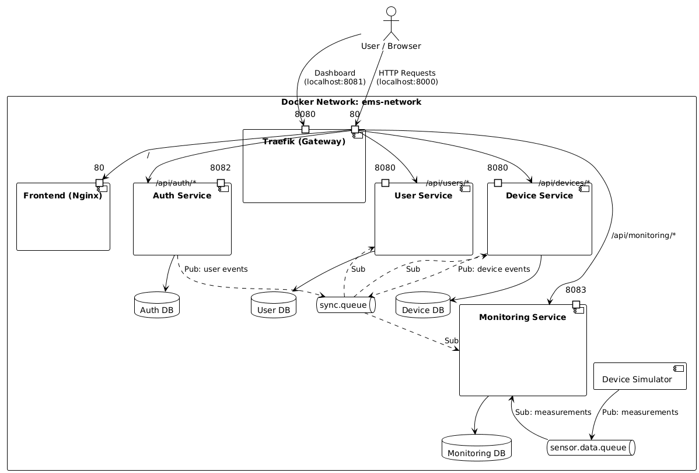

# Energy Management System - Assignment 2 Update

This document details the architectural evolution and new components introduced in Assignment 2. The system has transitioned from a synchronous REST architecture to a distributed, event-driven system powered by RabbitMQ.

## Architectural Changes

### 1. Asynchronous Communication (RabbitMQ)
We introduced **RabbitMQ** as the message broker to decouple services and enable asynchronous data processing.
* **`sensor.data.queue`**: Handles high-frequency energy measurements sent by the simulator to the Monitoring Service.
* **`sync.queue`**: A Fanout Exchange (`internal.exchange`) broadcasts synchronization events (user creation/deletion, device creation/deletion) to all interested services (`user-service`, `device-service`, `auth-service`, `monitoring-service`).

### 2. New Microservices & Components

#### **Device Simulator (Producer)**
A standalone Java Spring Boot application that acts as a smart meter.
* **Functionality:** Reads historical data from a CSV file (`sensor.csv`) containing timestamps, device IDs, and energy values.
* **Behavior:** Publishes JSON messages to `sensor.data.queue` at a configurable rate (e.g., simulating 1 hour of data every second).
* **Configuration:** Uses the `DEVICE_ID` environment variable to map data to a specific registered device.

#### **Monitoring Microservice (Consumer)**
A new service dedicated to data ingestion and analytics.
* **Data Ingestion:** Consumes messages from `sensor.data.queue`.
* **Buffering Logic:** Implements a sliding window buffer. It aggregates 6 consecutive measurements (representing 1 hour) before saving a single `HourlyConsumption` record to its dedicated `monitoring_db`.
* **Synchronization:** Listens to `sync.queue` to maintain a local cache of valid Devices. This allows it to validate incoming sensor data locally.
* **API:** Exposes endpoints for the frontend to fetch historical consumption data.

### 3. Legacy Service Refactoring & Cleanup
The existing services were updated to support the new event-driven flow and remove synchronous dependencies:
* **`auth-service`**:
    * **Producer:** Now publishes `create_user` and `delete_user` events to RabbitMQ. It acts as the single source of truth for user lifecycle management.
    * **Cleanup:** Removed the legacy `WebClient` implementation (`UserServiceClient.java`) that previously made direct HTTP calls to the User Service.
* **`user-service`**:
    * **Consumer:** Listens for `create_user` and `delete_user` events from Auth Service to manage user profiles asynchronously.
    * **Producer:** No longer handles user deletion directly; instead, the frontend now triggers deletion via the Auth Service to ensure consistency.
* **`device-service`**:
    * **Consumer:** Listens for `delete_user` events to clean up device associations if a user is removed.
    * **Producer:** Publishes `create_device` and `delete_device` events to sync with the Monitoring Service.

### 4. Frontend Visualization
* **Chart.js Integration:** The client dashboard now includes a "View Consumption" feature.
* **Interactive Graph:** Users can select a specific date to view a bar chart of their device's hourly energy consumption, fetched from the Monitoring Service.
* **Updated Workflows:** The "Delete User" action in the Admin dashboard now calls the Auth Service API instead of the User Service API, ensuring correct distributed deletion.

### 5. Deployment Diagram
The following diagram illustrates the complete deployment architecture, including the Docker network boundaries, service interactions, and port mappings. The flow is structured from the external User/Browser down through the API Gateway (Traefik) to the backend services, and finally to the asynchronous message broker and persistence layer.

### 6. Tracking RabbitMQ messages
* RabbitMQ messages can be tracked accessing **http://localhost:15672**
* Username: guest
* Password: guest

### 7. Auth
For authentication a predifined admin role was added to the system in order to prevent lockout on startup. Use this admin user to create new users and devices. 
* Username: admin
* Password: admin123