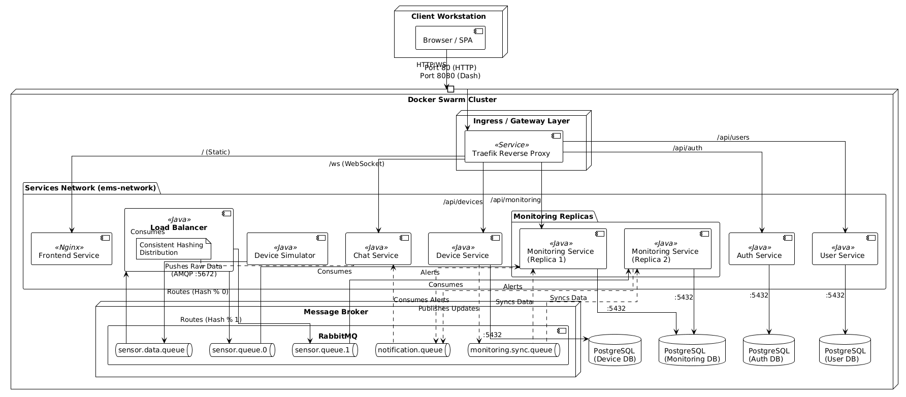

# Energy Management System - Assignment 3 Update (Docker Swarm & WebSockets)

## 1. Project Overview
This iteration of the Energy Management System (EMS) transforms the microservices architecture into a fully distributed system using **Docker Swarm**. It introduces advanced load balancing with consistent hashing, data synchronization between services using RabbitMQ, and a comprehensive real-time communication system featuring role-based chat (Admin-to-User) and AI-assisted support.

---

## 2. System Architecture

The system is deployed as a **Docker Swarm Stack** consisting of the following components:

### 2.1 Core Microservices
* **Traefik (Reverse Proxy):** Single entry point (Gateway) routing HTTP and WebSocket traffic to appropriate services.
* **Auth Service:** Handles JWT-based registration and authentication.
* **User Service:** Manages user CRUD operations (Admin/Client).
* **Device Service:** Manages smart metering devices and their association with users.
* **Monitoring Service (Replicated):** * Runs as **2 Replicas** in the Swarm.
    * Each replica listens to a specific partition queue (`sensor.queue.0`, `sensor.queue.1`) determined by its Swarm Task Slot.
    * Detects over-consumption and generates alerts.
* **Chat & Support Service:** Handles WebSocket connections for real-time alerts and the chat system.
* **Load Balancer Service:** A custom middleware that reads raw sensor data and distributes it to specific monitoring queues using **Consistent Hashing**.

### 2.2 Infrastructure
* **Databases:** 4 Isolated PostgreSQL instances (pinned to version 15) for User, Device, Auth, and Monitoring services.
* **Message Broker:** RabbitMQ for asynchronous sensor data processing, device synchronization, and system notifications.
* **Frontend:** Single Page Application (SPA) using Vanilla JS and Tailwind CSS, now featuring dynamic Chat UI and real-time Chart.js visualization.

---

## 3. Key Implementations

### 3.1 Distributed Load Balancing & Hashing
To handle high throughput from smart sensors, the system uses a custom routing strategy:
1.  **Simulator:** Generates energy data with specific `DeviceIDs`.
2.  **Load Balancer:** Consumes the raw `sensor.data.queue`.
3.  **Consistent Hashing:** The balancer hashes the `deviceId` and calculates `hash % replica_count`.
    * Devices mapped to index 0 -> routed to `sensor.queue.0`.
    * Devices mapped to index 1 -> routed to `sensor.queue.1`.
4.  **Partitioned Consumption:** `monitoring-service-1` processes only Queue 0, and `monitoring-service-2` processes Queue 1. This ensures data locality and prevents race conditions.

### 3.2 Data Synchronization
To ensure the Monitoring Service is aware of user-device assignments (which live in the Device Service), we implemented an Event-Driven Sync:
* **Trigger:** When an Admin assigns/unassigns a device or updates max consumption in the Device Service.
* **Action:** A message is published to `monitoring.sync.queue`.
* **Result:** The Monitoring Service consumes this message and updates its local database, ensuring alerts are sent to the *current* owner of the device.

### 3.3 Advanced Role-Based Chat System
The application features a bidirectional WebSocket chat with distinct modes for Admins and Clients.

#### **Client Mode**
Clients have a toggle switch in the chat interface:
1.  **Bot Mode (Automated):** * **Rule-Based:** Checks for keywords (e.g., "login", "bill", "device"). If a match is found, returns a predefined hardcoded response.
    * **AI Fallback (Grok):** If no rule matches, the query is forwarded to a Generative AI (Grok) to generate a helpful response.
2.  **Admin Mode (Human):** * Messages are routed to the global Admin topic.
    * The user waits for a human administrator to reply.

#### **Admin Mode**
Admins view a dedicated **Inbox Interface**:
1.  **Inbox List:** Displays a list of all clients who have sent messages, with badges for unread messages.
2.  **Private Sessions:** Clicking a user opens a private chat context with that specific `userId`.
3.  **Routing:** Admin replies are routed specifically to `/topic/user/{userId}`, ensuring only the target client receives the message (no broadcasting).

---

## 4. API & WebSocket Endpoints

### 4.1 REST Endpoints (via Traefik)
* `POST /api/auth/login` - Authenticate and retrieve JWT.
* `GET /api/devices/user/{id}` - Get devices for a specific client.
* `GET /api/monitoring/consumption/{id}` - Get hourly energy data.

### 4.2 WebSocket Topics (STOMP)
* **Endpoint:** `/ws` (SockJS)
* **Broker:** `/topic`
* **Destinations:**
    * `/topic/user/{userId}`: 
        * Receives **System Alerts** (Red Modal).
        * Receives **Bot Replies**.
        * Receives **Private Admin Messages**.
    * `/topic/admin`: 
        * Receives all messages sent by Clients in "Admin Mode".

---

## 5. Setup and Deployment

### 5.1 Prerequisites
* Docker & Docker Swarm initialized.
* Java JDK 21+ & Maven.

### 5.2 Build & Deploy (The "Nuclear" Option)
Since the system relies on specific database versions and Swarm networking, use these commands to ensure a clean slate:

```bash
# 1. Stop existing stack
docker stack rm ems

# 2. Clean up lingering volumes (Fixes DB version conflicts)
docker volume prune -f

# 3. Build the microservices
docker compose build

# 4. Deploy the Stack
docker stack deploy -c docker-compose.yml ems
```

###  5.3 Verification
Wait 60 seconds for RabbitMQ and Postgres to initialize.

```bash
# Check service replicas (Should see 1/1 or 2/2)
docker service ls

# View Load Balancer logs to verify Hashing
docker service logs -f ems_load-balancer
```

## 6. Deployment Diagram
The following diagram illustrates the complete distributed deployment architecture, orchestrated as a Docker Swarm stack. It details the Docker overlay network boundaries, interactions between service replicas, and public port mappings. The flow proceeds from the external User/Browser through the API Gateway (Traefik) to the backend Swarm services. Crucially, the diagram highlights the new Load Balancer service distributing sensor traffic via consistent hashing into partitioned RabbitMQ queues, which are then consumed by specific replicas of the Monitoring Service. Finally, it shows the asynchronous message broker facilitating both data ingestion and synchronization alongside the dedicated persistence layer for each microservice.

